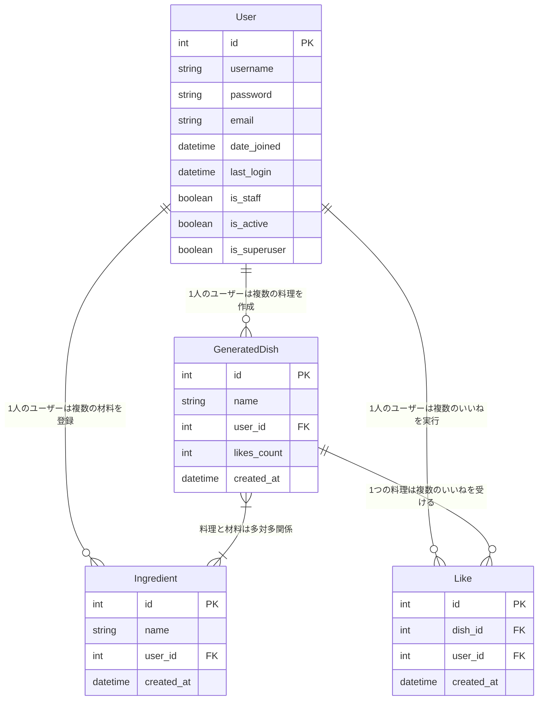

# 架空料理アプリ 仕様書

## 1. はじめに

### 1.1. アプリケーション名
**候補**: まやかしキッチン, ImaginaryDishes など（最終決定は別途）

### 1.2. コンセプト
冷蔵庫にあるものから、誰も食べたことのないような架空の料理名を生成し、記録するアプリケーションです。実用性は追求せず、ユーザーがクスッと笑えるような面白さと、自分だけの「妄想料理」をコレクションする楽しさを提供します。

ログイン機能により、ユーザーは個人の材料リストと生成・保存した料理名を管理でき、他のユーザーが生成した面白い料理には「いいね！」を付けて評価し、そのランキングを閲覧できます。

### 1.3. ターゲットユーザー
- 日常生活にちょっとしたユーモアを求める人
- 料理のアイデアが欲しいわけではないが、暇つぶしに面白いものを探している人

## 2. 機能要件

### 2.1. ユーザー認証機能

#### ユーザー登録
新規ユーザーがユーザー名、パスワード、メールアドレス（任意）でアカウントを作成できる。

#### ログイン/ログアウト
既存ユーザーがユーザー名とパスワードでログインし、セッションを終了できる。

#### 認証によるアクセス制御
ログイン中のユーザーのみが以下の機能を利用できる：
- 自分の材料の登録・管理
- 架空料理名の生成・保存
- 他のユーザーへの「いいね！」評価

### 2.2. 材料の登録・管理

#### 材料追加
- ログインユーザーが手持ちの材料名（例: 卵、ネギ、チーズ、期限切れの牛乳）を自由に入力し、データベースに保存できる
- 同じユーザーが同じ名前の材料を重複して登録できないようにする

#### 材料一覧
ログインユーザーが登録済みの材料を一覧で確認できる。

#### 材料編集・削除
ログインユーザーが登録した材料の名前を変更したり、不要な材料を削除したりできる。

### 2.3. 架空料理名の生成

#### 生成トリガー
ボタン一つで架空料理名を生成できる。

#### 生成ロジック
- ログインユーザーが登録した材料の中からランダムに複数選択し、それらを組み合わせて料理名を生成する
- **例**: 「ネギとチーズのきのこ爆弾」「期限切れ牛乳と卵の闇鍋」
- 生成テンプレートを複数用意し、ランダムに適用する

#### 生成結果表示
生成された架空料理名を表示する。

### 2.4. 生成された架空料理名の保存・評価・ランキング

#### 料理名の保存
- 生成された架空料理名が気に入った場合、保存ボタンを押してデータベースに記録できる
- 保存時には、その料理に使用された材料と、生成したユーザーが紐付けられる

#### 評価機能
- ログインユーザーは、他のユーザーが保存した料理名に対して「いいね！」を付けられる
- 同じユーザーが同じ料理に複数回「いいね！」できないようにする

#### 自分の保存済み料理名一覧
ログインユーザーが保存した架空料理名を一覧で確認できる。

#### ランキング表示
- 全ユーザーが生成・保存した架空料理を、「いいね！」の数が多い順にランキング形式で表示する
- ログイン不要で閲覧可能とする

### 2.5. 初期ページ（トップページ）

#### デモ機能
- ログインしていなくても、その場でいくつかの材料を入力して、試しに架空料理名を生成できるデモ機能を提供する
- デモで生成された料理名は保存できない

#### キャッチフレーズとアプリ説明
アプリのコンセプトや「クスッと笑える」面白さを伝える。

#### 認証への誘導
- デモ機能の近くに、ログイン・ユーザー登録へのボタンを配置
- 保存機能や個人管理のメリットを提示して誘導する

#### グローバルランキング表示
- ログイン不要で、全ユーザーの架空料理ランキングの一部をトップページに表示
- アプリの面白さをアピールする

## 3. 非機能要件

### パフォーマンス
- 一般的なWebアプリケーションとして、許容できるレスポンスタイムを維持する
- データベースクエリは最適化を考慮する

### セキュリティ
- Djangoの標準認証システムを利用し、パスワードのハッシュ化、CSRF対策、XSS対策など基本的なWebセキュリティを確保する
- ユーザーデータへのアクセスは、認証されたユーザーのみに限定する

### UI/UX
- 直感的でシンプルなインターフェース
- 主要な操作はボタン一つで完結できる簡潔さ
- 「クスッ」と笑えるような、少しシュールで遊び心のあるデザイン要素を取り入れる
- レスポンシブデザインに対応し、PC、タブレット、スマートフォンで適切に表示・操作できる

### メンテナンス性
- コードはDRY (Don't Repeat Yourself) 原則に従い、再利用性を考慮する
- 適切なコメントとドキュメンテーションを記述する

## 4. データベース設計

### 4.1. ER図

### 4.2. モデル詳細

#### User
Django標準のUserモデルを使用。

#### Ingredient
- **id**: (PK) 自動採番
- **name**: 材料名 (CharField, max_length=100)
- **user**: 登録ユーザー (ForeignKey to User, on_delete=CASCADE)
- **created_at**: 登録日時 (DateTimeField, auto_now_add=True)
- **制約**: (name, user) の組み合わせで一意（同じユーザーが同じ材料名を重複登録できない）

#### GeneratedDish
- **id**: (PK) 自動採番
- **name**: 料理名 (CharField, max_length=200)
- **user**: 作成ユーザー (ForeignKey to User, on_delete=CASCADE)
- **ingredients**: 使用材料 (ManyToManyField to Ingredient)
- **likes_count**: 「いいね！」の数 (IntegerField, default=0)
- **created_at**: 作成日時 (DateTimeField, auto_now_add=True)

#### Like
- **id**: (PK) 自動採番
- **dish**: 対象料理 (ForeignKey to GeneratedDish, on_delete=CASCADE)
- **user**: 「いいね！」したユーザー (ForeignKey to User, on_delete=CASCADE)
- **created_at**: 「いいね！」した日時 (DateTimeField, auto_now_add=True)
- **制約**: (dish, user) の組み合わせで一意（同じユーザーが同じ料理に複数回「いいね！」できない）

> **注意**: Likeモデルの作成/削除時にGeneratedDish.likes_countを自動更新するロジックを実装する。

## 5. 技術スタック

- **フレームワーク**: Django (Python)
- **データベース**: SQLite (開発時)
- **フロントエンド**:
  - HTML, CSS (CSS変数またはSass/SCSS)
  - JavaScript (必要に応じて)

## 6. 開発ロードマップ

### ステップ1: プロジェクト初期設定
- Djangoプロジェクトとアプリケーション (core, accounts, ingredients, dishes) の作成
- settings.pyの基本設定

### ステップ2: データベースモデルの定義とマイグレーション
- Ingredient, GeneratedDish, Like モデルの定義
- makemigrations, migrate の実行

### ステップ3: ユーザー認証機能の実装
- accountsアプリでのユーザー登録、ログイン、ログアウト機能の実装
- settings.pyでのリダイレクトURL設定

### ステップ4: 材料のCRUD機能の実装
- ログインユーザーに紐付いた材料の追加、一覧、編集、削除機能

### ステップ5: 架空料理名の生成機能の実装
- ログインユーザーの材料に基づいた料理名生成ロジックの実装

### ステップ6: 架空料理名の保存機能の実装
- 生成された料理名をデータベースに保存する機能

### ステップ7: 自分の保存済み料理名一覧表示機能の実装
- ログインユーザーが保存した料理名を確認できるページ

### ステップ8: 「いいね！」評価機能の実装
- Likeモデルのロジックと、GeneratedDish.likes_countの自動更新（シグナルなど）

### ステップ9: ランキング表示機能の実装
- 「いいね！」数に基づく全料理のランキング表示

### ステップ10: 初期ページ（トップページ）の実装
- デモ機能、認証誘導、ランキング一部表示の統合

### ステップ11: UI/UXの洗練
- カラースキームの適用、レスポンシブデザイン、全体的なデザイン調整

### ステップ12: テストとデプロイ
- 単体テスト、結合テストの実施
- 本番環境へのデプロイ準備

---

> この仕様書は、開発を進める上での指針となります。必要に応じて、機能の追加や変更、詳細化を行っていきましょう。